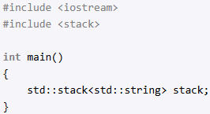
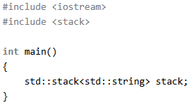

1. Save image (.png fomat) in ./input
2. Run remove_bg_win.py
3. Click "Remove background"
4. See clear photo in folder ./output

Description:
This program removes the background from the image (it selects the most popular color)

WARNING program needs pip install pillow
Example: 
before:

after:

